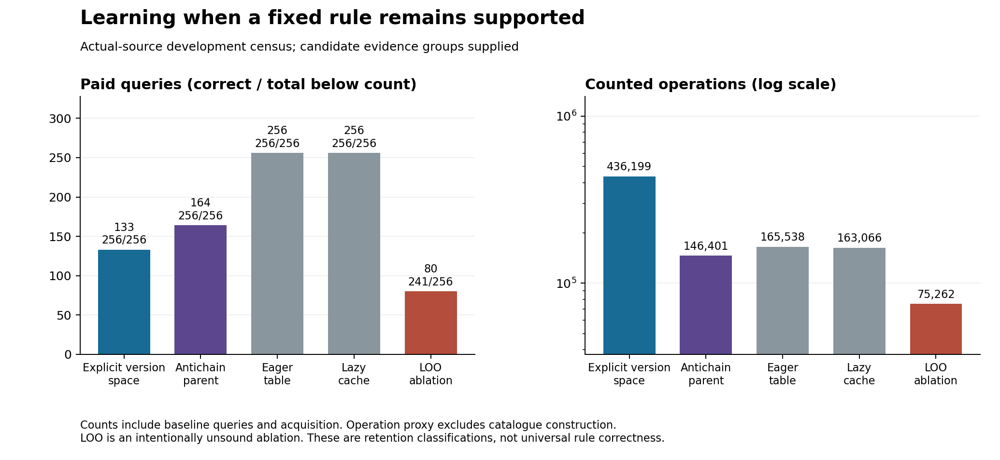

# Cognitive learning theory: formal reduction and an actual-source learning result

This tranche adds a scoped formal core, ten typed learning/operator donor forms,
an executed F4 support-learning component, a preliminary manuscript, and an
evidence-linked publication audit. It does not complete the general cognitive
ladder or establish top-tier publication readiness.

## What was learned and what improved

A new effect object learns whether a fixed induced method remains the same
representation after subsets of its original evidence are withdrawn. All 16
methods in the pinned scale-one dependency source were included, with all 16
live-evidence configurations each. The four-block candidate grouping and
learning algorithms were supplied; the effect values were acquired through paid
source induction calls. These are previously exposed development families.

| Arm | Correct retention | Paid source queries | Counted operations | Acquisition-checkpoint bytes |
|---|---:|---:|---:|---:|
| active_monotone | 256/256 | 133 | 436,199 | 27,259 |
| antichain_parent | 256/256 | 164 | 146,401 | 27,587 |
| eager_table | 256/256 | 256 | 165,538 | 28,612 |
| lazy_cache | 256/256 | 256 | 163,066 | 26,161 |
| loo_ablation | 241/256 | 80 | 75,262 | 25,988 |

The conventional antichain learner is the lowest counted-work correct arm in
this comparison. Relative to lazy exact-mask caching it uses **35.94% fewer
source queries and 10.22% fewer counted operations**, including acquisition.
It correctly infers **92 unqueried masks after file reload**. Removing learned
generalization while preserving acquired exact answers requires **92 additional
real inductions**. Thus this learned object does more than retain queried
answers, within its declared four-block domain.

The explicit version-space learner infers 123 unqueried masks and uses the
fewest source queries, but costs **2.98 times** the antichain learner's counted
operations. Its model construction and selection overhead defeat a simple
fewer-queries-equals-cheaper-learning argument. The singleton-deletion ablation
makes **15 stale-retention errors**, with zero collateral-reopening errors.

Correct means agreement with the independent pinned-induction representation
retention checker. It does not mean that the retained rule is mathematically
correct on every unseen game position. No arbitrary replacement rule is learned
by this Boolean effect model. A changed rule, evidence universe, ordering,
source version or authority scope requires reopening/fallback.



The operation sum is an explicit instrumentation proxy: source shape checks,
observation reads and learner operations. Catalogue construction, Python runtime
work and all serialization work are not completely represented by that sum.
Process timing includes removal/scorer/audit work and is diagnostic, not a
clean treatment-deployment speed comparison. Keep the component vector.

Storage above is measured **after acquisition and before service**. The lazy
arm subsequently learns 240 cache entries without rewriting its acquisition
snapshot; its post-service record is preserved in the result receipt. Therefore
these bytes do not compare matched final-lifetime storage. The learned object
is file-reloaded inside the arm process; complete OCM state migration, separate
post-adoption process restart and persistence after every revision remain open.

## What additional forms of learning are worth engineering

The [typed catalogue](OPERATOR_CATALOGUE_V1.json) and
[donor map](LEARNING_OPERATOR_DONOR_MAP.md) cover ten forms. Three next targets
are prioritized by actual exposed failure evidence:

1. **Alternative-support acquisition:** learned sufficient support alternatives,
   exact scoped inference and conservative reopening. This tranche supplies a
   working component and a conventional-parent result.
2. **Library induction across sound equivalences:** learn parameterized methods
   from genuinely checked traces, including syntactically different equivalent
   computations. Original F1 trace bodies are still missing; their absence
   prevents reconstructing the historical cause from its summary alone.
3. **Cost-aware routing and incremental maintenance:** learn when a method/index
   is worth invoking or updating. Compare against equally adaptive conventional
   portfolios, and retain short-lifetime/drift regimes where setup loses.

Decision-sufficient probing, failure-derived constraints, counterexample-guided
refinement, behavioral representations and meta-learning/replay are additional
conditional donors. HEC/EC2 already own decision-region information acquisition;
ATMS/antichains own alternative supports; DreamCoder/Stitch/babble own important
library-learning components. No newly necessary cognitive primitive or unique
OCM residual was found in this tranche.

The smallest next integration is an externally governed **retention adviser**
attached to the actual persisted method: TRUE can retain only the same baseline
representation within verified scope and original per-task checks; FALSE
reopens and reinduces; UNKNOWN or a changed scope falls back. Persist the method,
effect observations and dependencies together. Then freeze and test complete
revocation/query/restart lifecycles against equally learned parents. The current
mask census does not perform that integration or earn a third OCM generation.

## Formal results and exact scope

[FORMAL_CORE.md](FORMAL_CORE.md) supplies explicit assumptions and written proofs
for FC1–FC7: version spaces and revocation; conservative impact sets; common
acceptable actions; optimal physical probe spend; fixed-rule support retention;
lifecycle-preserving quotients; and conditional payback. These are adopted
parent results, not novel theorems or a universal theory of cognition.

The independently implemented [finite verifier](exact_verification.py) reports:

- **87,808** complete decision/probe systems: version-space dynamic programming
  agrees with enumeration of **291** nonrepeating action-labelled trees.
- **3,584** impact/version-space cases and **28,672** covering-footprint checks.
- All monotone support functions on zero through three variables recovered by
  independent truth-table and antichain constructions (20 functions at three).
- A 160-state deletion lifecycle has two immediate-output classes but 20
  lifecycle classes; current-answer equivalence loses future revision behavior.
- Fixed-ranked consistency and evidence-revocation checks pass their explicitly
  enumerated domains.

Policy computation is not free merely because a probe-spend optimum is known.
The common-action stopping theorem is directly parent-owned by decision-region
determination. The new support pilot identifies the complete *retention
property*, and does **not** test stopping early once a repair decision is safe.

## Freeze, evidence and review

The support protocol and source were published **before the new census ran**:
remote commit `613ac75492734c5f2a239673759ffd2b20a637c6`, tree
`d5e40ef0ff36a4d29aac5709fd0602c159aa2004`; identical local tree at
`f62bfc8e89e746ce39724546987abd1accd219cd`.
Registration SHA256:
`651ea38bc2d619decece6b1bd0148e53ececee3e8024a1b1a78a0519bbaa86f6`.
This is a newly frozen **E2 development census**, not E3 confirmation because
its source families were already exposed. No protected outcome was accessed.

The frozen [registration](SUPPORT_DEVELOPMENT_REGISTRATION_V1.json),
[protocol](STRUCTURE_LEARNING_PROTOCOL.md), [raw result directory](results/support-development-v1)
and [exact theory receipt](results/exact-verification-v1.json) retain the source,
configuration, probes, predictions, snapshots, all ablations and negative
results. The plotted table is generated from receipts; a later display-only
change shortened overlapping figure labels without changing any endpoint,
analysis definition, study source, registration or raw observation.

Five collaborating roles covered formal theory, learning/prior art, epistemic
verification, source engineering and hostile review. Findings were cross-reviewed.
Checks caught and fixed pre-outcome errors in baseline query accounting,
retention of failed observations, uncertainty labels, receipt-only semantic
identity, and conflation of identical payloads with distinct evidence occurrences.
Seven learner-assurance and six readiness-inventory checks pass. Internal
AI-assisted checks are not external or authorship-independent replication.

## Publication disposition

A full [preliminary manuscript](MANUSCRIPT_DRAFT.md),
[editorial blueprint](MANUSCRIPT_BLUEPRINT.md),
[three-report review and synthesis](PUBLICATION_READINESS_REVIEW.md),
[claim registry](THEORY_EMPIRICAL_REGISTRY_V1.json), and
[readiness gates](READINESS_GATES.json) are included. The [computed inventory assessment](results/publication-readiness-v1.json) retains all nine blocking gates. The [environment record](ENVIRONMENT_MANIFEST.json), [AI-use/accountability record](AI_USE_AND_ACCOUNTABILITY.json) and [artifact checksums](EVIDENCE_MANIFEST.json) support reproduction without claiming external validation.

The scoped mathematical reconstruction and exact component experiment are
complete at their stated boundaries. The proposed top-tier contribution remains
**DO_NOT_SUBMIT_YET**: a novel residual beyond matched parent products,
confirmatory evidence and disjoint replication, complete lifecycle/resource
integration, and independent reproduction are still missing. A preliminary
draft cannot supply those facts. Human accountability and final authorship,
funding/conflict and AI-use declarations also require the actual researchers.

The inventory tool checks files and their hashes. It cannot establish that the
chosen inventory is exhaustive, that a claim is true, that a contribution is
novel, or that a journal will accept it. Even an all-MET inventory only requests
independent scientific review.

## Reproduce

From repository root, use new result/figure directories so prior attempts remain
immutable:

```sh
python research/cognitive-learning-theory-v1/test_support_effects.py
python research/cognitive-learning-theory-v1/test_readiness.py
python research/cognitive-learning-theory-v1/exact_verification.py --out /tmp/ocm-exact-verification.json
python research/cognitive-learning-theory-v1/run_support_development.py --registration-sha256 651ea38bc2d619decece6b1bd0148e53ececee3e8024a1b1a78a0519bbaa86f6 --out /tmp/ocm-support-reproduction
python research/cognitive-learning-theory-v1/plot_support_results.py --results /tmp/ocm-support-reproduction --out /tmp/ocm-support-figures
python research/cognitive-learning-theory-v1/assess_readiness.py --gates research/cognitive-learning-theory-v1/READINESS_GATES.json
```

See each receipt for exact software scope. A same-host rerun is not external
replication and does not change the evidence class.

## Scientific checkpoint

THEORY QUESTION: Which learned structures make future governed repair cheaper?
CURRENT HYPOTHESIS: Paid alternative-support acquisition can reduce repeated
source reinduction while preserving fixed baseline-retention judgments.
STRONGEST PARENT: Conventional monotone antichain learner and exact-mask cache.
FORMAL OBJECT: Fixed-ranked induction, monotone retention property, scoped
observations and persistent effect records.
PREDICTION: Sound unqueried-mask inference after reload; removal restores queries;
explicit version-space overhead may dominate.
FALSIFIER: Retention errors, no sound inference beyond queried answers, failed
restart, scope violations or acquisition costs erasing the gain.
VERIFICATION ROUTE: V1 parent reconstruction; V2 exact calibration; V3 E2 source
census for the component (not protected validation).
EMPIRICAL RUNG: CL6 development component; no rung exit.
RESULT: Antichain256/256,92 new-mask inferences,10.22% less counted work than cache.
NEGATIVE / COUNTEREXAMPLE: Active selection costs2.98x antichain despite fewer
queries; singleton ablation has15 stale predictions; final persistence incomplete.
WHAT WAS REMOVED OR MERGED: Decision-sufficient theory novelty, full-structure
identification prerequisite, singleton dependency sufficiency, explicit-model
complexity presumed beneficial.
WHAT SURVIVES: Parent-owned support-property learning at declared source scope.
CLAIM CEILING: No new primitive, complete causal discovery, new M11 generation,
cross-domain transfer, whole-system Pareto dominance or submission readiness.
EXACT ARTIFACTS: Linked registrations, code, immutable receipts and figure sources.
NEXT DECISIVE TEST: Integrate the antichain adviser with real method/effect
persistence and revised-rule checking, then test a separately frozen complete
lifecycle; global grouping discovery remains a distinct larger question.
