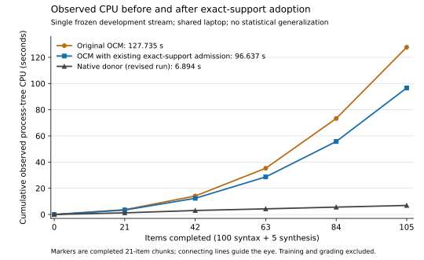

# G1 admission support: development evidence

**Existing exact-support computation preserves this run's outputs and reduces observed restart work.** OCM still incurs substantial additional work relative to the adopted native donors.

Classification: `INFRASTRUCTURE` / `SUPPORTING`; public development evidence, not protected acceptance.
Owner: [#72](https://github.com/SzeChunYiu/ORION-OCM/issues/72#issuecomment-5556083519); links: [#69](https://github.com/SzeChunYiu/ORION-OCM/issues/69), [#73](https://github.com/SzeChunYiu/ORION-OCM/issues/73), [#50](https://github.com/SzeChunYiu/ORION-OCM/issues/50), [#62](https://github.com/SzeChunYiu/ORION-OCM/issues/62), [#42](https://github.com/SzeChunYiu/ORION-OCM/issues/42), [#38](https://github.com/SzeChunYiu/ORION-OCM/issues/38) / [#49](https://github.com/SzeChunYiu/ORION-OCM/issues/49).

| Recorded stream | Native CPU (s) | OCM CPU (s) | OCM outer wall (s) |
|---|---:|---:|---:|
| Original | 6.852 | 127.735 | 134.503 |
| Exact-support admission | 6.894 | 96.637 | 103.313 |

Both runs retain 105/105 accepted native outputs and admitted OCM outputs. Each has 100/100 native–OCM tree agreement and 5/5 independently grammar-checked, Z3-verified programs per arm. Syntax base LAS remains 1234/1584 (77.904%); exact trees 32/100. See [original grade](original/grade.json) and [revised grade](revised/grade.json).

The [final-source replay](replay-final/receipt-final.json) preserves the full snapshot, 1,055-event chain/head and resource proxy totals; both arms report unchanged state files. Reload wall: 14.779 s original, 3.125 s revised. This is one descriptive diagnostic.

The figure uses chunk endpoints, the revised-run native curve, and no pooled runs or error bars. It supports a bounded engineering observation about preserved function and reduced observed work. It establishes no sparse cognition, capability superiority, LLM comparability, whole-lifetime efficiency or Machine Epistemics advantage.

Read [READOUT.md](READOUT.md) for scope, custody and failure history. [cpu-series.json](cpu-series.json) gives exact points and bindings. Rebuild the figure with existing matplotlib: `python3 plot_cpu.py` ([script](plot_cpu.py)); no actors execute.

Raw records: [original](original/receipt.json), [revised](revised/receipt.json), [frozen plan](plan/plan.json), [profile](profile/receipt.json), [final replay](replay-final/receipt-final.json), [prior replay](replay-prior/receipt.json), [failed import](diagnostic-import-error/original.stderr), [before tests](tests/support-before.xml), [304-pass tests](tests/support-after.xml), [final 42-pass tests](tests/support-final-optimization.xml).

[origins.json](origins.json) maps exact raw copies to their source locations; [SHA256SUMS](SHA256SUMS) binds the package files. Model/state binaries are excluded. [package-check.json](package-check.json) records packaging checks, not a new benchmark or test-suite run.
