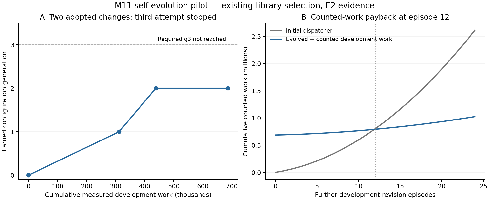

# M11 self-evolution connected to actual cognitive-ladder failures

**The machine earned two development adoptions. The required third generation
was not achieved.** This is an executable M11 integration and a bounded test of
machine-selected existing alternatives, with conventional-parent sufficiency.
It is not autonomous operator invention or completion of the full programme.

The lane and its complete future acceptance standard are in [PROGRAMME.md](PROGRAMME.md).
All work is isolated from production and protected empirical outcomes.

## Measured trajectory

The host supplies a fixed catalogue of existing relevance/dependency algorithms.
OCM receives numeric evidence, starts with all D0–D8 unknown, chooses paid
counterfactuals, creates a prediction, runs disjoint development shadow samples,
and submits the measured proposal to the external host adopter. No supplied
correct layer or generation-specific repair schedule enters its choice policy.

| Cycle | Machine-selected outcome | Development shadow target | Fresh after restart |
|---|---|---|---|
| g0 → g1 | Route relevance requests to existing signature-index parent | Work 20,970 → 20,406; bytes 11,735 → 6,695; exact quality retained | Work 21,150 → 20,586; improvement retained |
| g1 → g2 | Route revisions to existing lazy dependency learner | Work 14,057 → 2,197; bytes 18,737 → 15,833; whole revision episode becomes exact | Work 21,081 → 3,077; whole episode becomes exact |
| g2 → g2 | No candidate satisfies the registered improvement contract | No new proposal or adoption | Current and previous machine coincide |

There were eight paid candidate probes in each cycle. Preservation samples
passed for both adoptions. A cloned-store audit rolled back the second adoption,
cold-restarted at g1, and verified exact replay. D1 means a tested C1 routing
change sufficed; it does not establish the unique historical cause of F3/F4.

The initial six incidents retain incomplete raw-trace status. F2/F3 share one
source receipt. F1/F5/F6 remain summary-only intake without a new causal
localization. Later relevance/dependency measurements are freshly executed
actual-source continuations, not a claim that missing original traces were
recovered. The engineering team saw the human diagnoses; the finite controller
did not receive them.

## Did later savings repay self-improvement?

The first pilot spent **686,855 counted work units**, including rejected probes,
both shadow arms and both fresh-use/ablation arms. It did not repay that cost
during the short initial trajectory. A separately frozen follow-up then ran all
24 new development revision episodes, irrespective of payback.

- Counted-work payback occurred at **episode 12**.
- At episode 24: **1,024,703 evolved work units**, including all prior development,
  versus **2,613,144 initial-machine units** — **60.8% less counted work**.
- **24/24 complete five-revision episodes** were exact with the evolved machine;
  **0/24 complete episodes** were exact with the initial machine. The latter
  does not mean every individual revision was wrong.
- Host wall time including prior development: **4.46 s evolved versus 4.22 s
  initial**. **No wall-time advantage was demonstrated.**

These source counters are an explicit registered work model, not bit complexity
or energy. Common donor catalogue/store materialization and M11 host operations
are outside those counters; their costs appear in wall/storage receipts. Thus
counted-work payback does not mean every computational cost has been repaid.
Persistent M11 history, field/index bytes and raw recording carry
additional storage costs. This is a bounded work/quality improvement with
resource tradeoffs, not uniform whole-system dominance. Payback depends on this
declared growing revision ecology and does not establish a population rate.



Panel A counts adopted dispatcher generations, not a scalar measure of general
cognition. Panel B includes all measured initial development work. Both plots
use development evidence; neither is protected or independent-domain validation.

## What is and is not evolving

The evolving persistent object is the dispatcher configuration and real M11
history. Each challenger task reconstructs the donor field and library. This
does **not** demonstrate migration/persistence of a complete learned cognitive
field, a learned proposal policy, a machine-chosen research agenda, or genuinely
new candidate invention. The host selected the incident sequence and supplied
the bounded alternatives. The controller selected their changes from outcomes.

A conventional ordered finite search with the same catalogue implements this
policy exactly: `AUTOML_PARENT_SUFFICIENT_BY_CONSTRUCTION`. No superiority over
that parent is claimed. Other full adaptive parent trajectories, including
Bayesian/evolutionary/program-repair/learned-selector/reflection and neural
comparisons, remain NOT RUN. The separate polynomial semantic-reuse improvement
is explicitly a human-supplied engineering repair, not a machine invention.

## Governance and evidence

The module connects actual M11 failure, diagnosis, proposal, prediction receipt,
shadow, assurance, adoption, migration/reopening, restart and rollback APIs.
An added external gate checks measured resource benefits and preservation;
standard M11 alone does not validate cost-only predictions. Semantic task IDs
prevent simple relabeling across cycles; protected intake/mutation is refused.
The final freeze tests that boundary only. Protected protocol status is E0 /
NOT_READY; no protected study ran.

Eighteen governance tests pass. They caught a real mutable-candidate alias bug:
shadow could measure one configuration while adoption installed another. The
pre-freeze fix detaches candidate data and binds installation to the serialized
shadow configuration. These mocked interface tests are software assurance, not
cognitive evidence. An independent review also required rejecting missing work
counters instead of silently treating them as zero; fixed before execution.

Development protocol/source freeze: `2ec556225d78d448a8b19eaec1a27d2dfc5086e5`.
Payback protocol/source freeze: `aeaa45b`. Both are local pre-outcome freezes,
not retrospective claims of publicly timestamped E3 registration. Raw pilot
receipts, M11 ledgers, machine snapshots and rollback artifacts are in
[results/run-v1](results/run-v1); all continuation rows are in
[results/payback-v1/result.json](results/payback-v1/result.json).
The compact summary's calibration projection uses an obsolete field name and
is null; complete `resource_prediction_calibration` values are retained in
each raw cycle file. The first change's shadow deltas matched; the second's
direction held but its magnitude differed at the larger shadow scale. No
calibration-success claim is inferred from missing summary fields.

## Scientific checkpoint

- THEORY QUESTION: Can OCM select and retain beneficial changes from its own measured failures?
- CURRENT HYPOTHESIS: Governed finite counterfactual search can improve a bounded dispatcher frontier.
- STRONGEST PARENT: The same conventional search/controller and existing component algorithms; additional full parent trajectories unrun.
- FORMAL OBJECT: Persistent plain-data dispatcher, M11 evidence/lineage, finite C1 alternatives, external Pareto/authority contract.
- PREDICTION: Development-selected work/quality gains survive disjoint shadow and post-restart use; later savings may repay all search costs.
- FALSIFIER: Regression, no adequate candidate, missing measurement, failure after restart, excessive search cost, or parent sufficiency.
- VERIFICATION ROUTE: V3 development pilot with exact component checks; E2/L0.
- EMPIRICAL RUNG: CL0 measurement and bounded CL1/CL6 integration; no rung exit.
- RESULT: Two earned changes; counted-work payback at episode 12 on the frozen continuation.
- NEGATIVE / COUNTEREXAMPLE: Third change absent; no wall-time payback; no novel mechanism or controller residual.
- WHAT WAS REMOVED OR MERGED: Claims that external repair selection was machine invention, or that cost-only M11 assurance was sufficient.
- WHAT SURVIVES: Executable governed selection and persisted C1 changes on actual-source development episodes.
- CLAIM CEILING: Bounded existing-library adaptation with conventional-parent sufficiency. Required g3 and full self-evolution hypothesis remain open.
- EXACT ARTIFACTS: Pinned donor/intake manifests, development/payback registrations, scripts, raw traces, M11 ledgers and figures.
- NEXT DECISIVE TEST: Recover original F1/F5/F6 probe traces; learn proposal selection across disjoint incidents with matched adaptive parents; require an earned third change and whole-field persistence before protected evaluation.

## Reproduce

From repository root:

```sh
PYTHONPATH=src python research/self-evolution-v1/test_evolution.py
PYTHONPATH=src python research/self-evolution-v1/run_development.py --out /tmp/ocm-self-evolution-new
PYTHONPATH=src python research/self-evolution-v1/run_payback.py --source /tmp/ocm-self-evolution-new --out /tmp/ocm-self-evolution-payback-new
python research/self-evolution-v1/plot_results.py
```

Use new output paths; scripts refuse to overwrite previous attempts.
